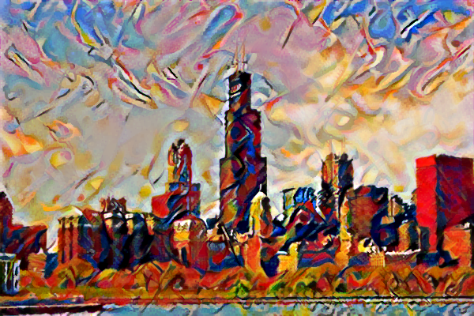
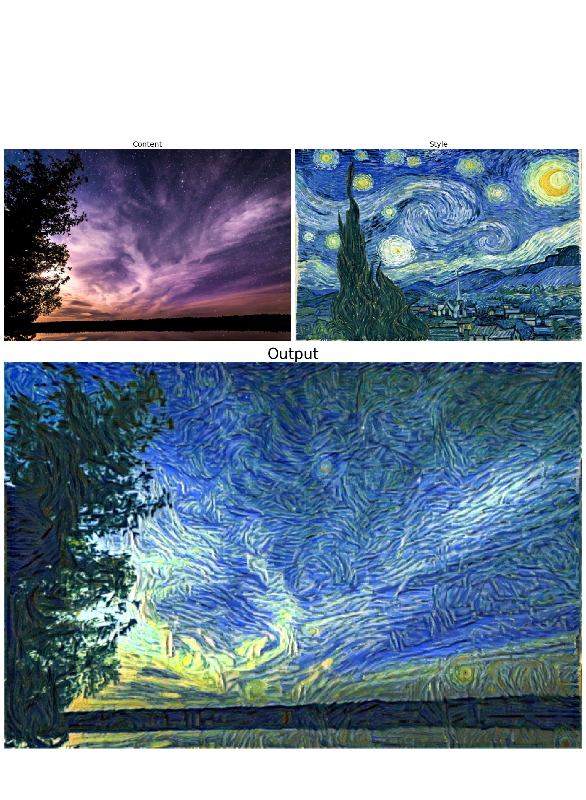
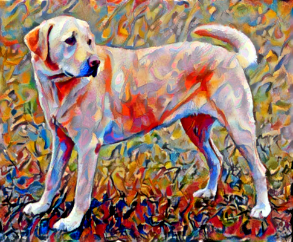

# Style Transfer with Pytorch

[](https://colab.research.google.com/github/Shawn-xyg/style_transfer_with_pytorch/blob/master/Style_Transfer.ipynb)


A simple implementation of neural style transfer on Pytorch.

This project is based on Udacity's code skeleton for style transfer: [style-transfer](https://github.com/udacity/deep-learning-v2-pytorch/tree/master/style-transfer). In addition to the project's original goal to stylize an image, I expanded the style transfer functionality by incorporating more image initialization methods, total variation denoising, and wrapped the entire training process in a function for more convenient experiment.


## Getting Started

### Prerequisites

```
python 3.6+
tqdm==4.46.1
torchvision==0.6.0
torch==1.5.0
requests==2.23.0
Pillow==7.0.0
numpy==1.18.1
matplotlib==3.1.3
```

## Instructions

The notebook is also hosted on Google Colab. Feel free to try it out here: [Colab Notebook](https://colab.research.google.com/github/Shawn-xyg/style_transfer_with_pytorch/blob/master/Style_Transfer.ipynb).

You can use whatever images you want by replacing the `style_path` and `content_path` parameters of the function `stylize`.

## Examples








## Authors

- Shawn Gong

## License

This project is licensed under the MIT License - see the [LICENSE.md](https://gist.github.com/PurpleBooth/LICENSE.md) file for details

## Acknowledgments

- Udacity for the code skeleton
